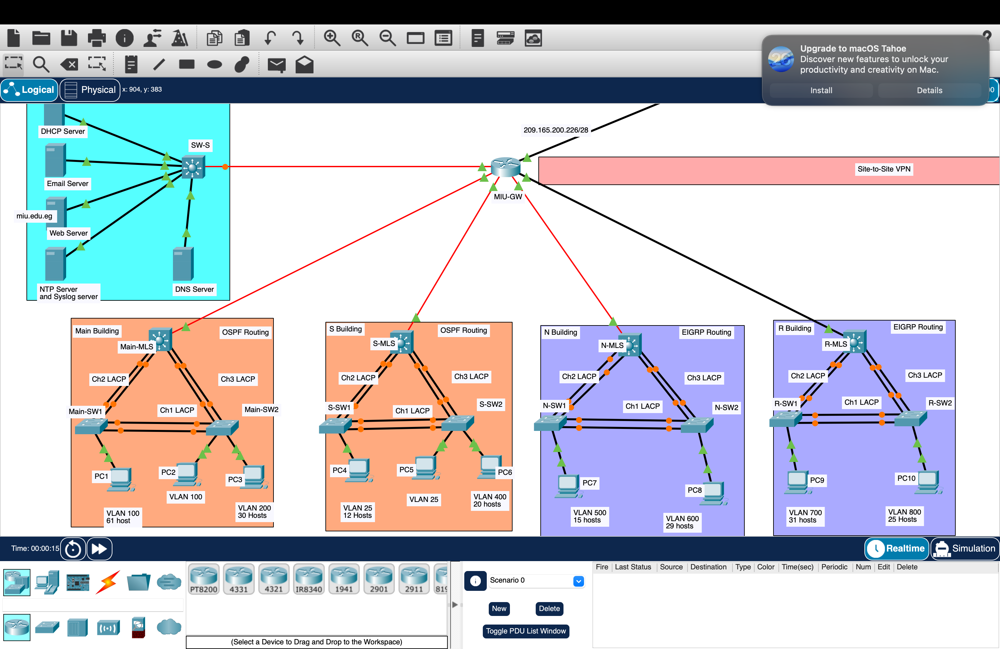
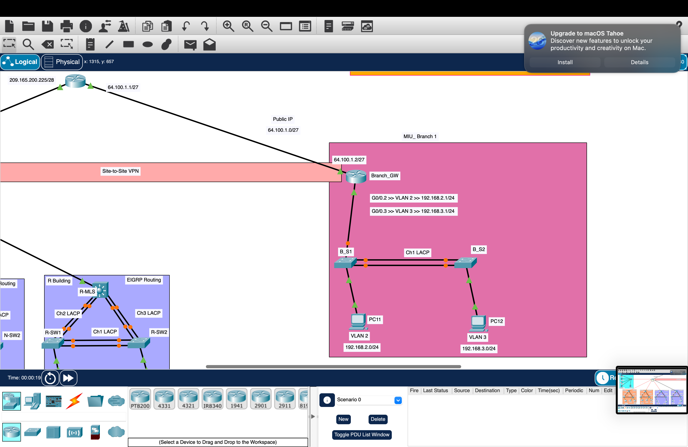
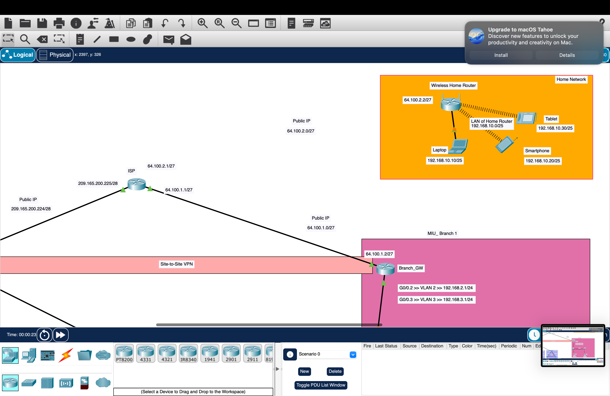

---

## 🏢 Buildings & VLANs

| Building | MLS | Access Switches | Routing | VLANs | Hosts |
|----------|-----|-----------------|---------|-------|-------|
| **Main** | Main-MLS | Main-SW1, Main-SW2 | OSPF | 100, 200 | 61 + 30 |
| **S** | S-MLS | S-SW1, S-SW2 | OSPF | 25, 400 | 12 + 20 + 20 |
| **N** | N-MLS | N-SW1, N-SW2 | EIGRP | 500, 600 | 15 + 29 |
| **R** | R-MLS | R-SW1, R-SW2 | EIGRP | 700, 800 | 31 + 25 |

Each building uses a **triangle topology** with three LACP EtherChannel bundles:

- **Ch1** — between access switches (cross-link)
- **Ch2** — MLS to first access switch
- **Ch3** — MLS to second access switch

This provides **link redundancy** and **load balancing** at Layer 2.

---

## 🖥️ Server Farm

Centralized services behind `SW-S`, reachable from every building:

| Server | Purpose |
|--------|---------|
| **DHCP Server** | IP allocation for all campus VLANs |
| **Email Server** | Internal mail services |
| **Web Server** | Hosts `miu.edu.eg` |
| **DNS Server** | Name resolution for the domain |
| **NTP / Syslog Server** | Time synchronization + centralized logging |

DHCP Relay is configured on each MLS to forward requests to the central DHCP server across VLAN boundaries.

---

## 🌐 Public IP Allocation

| Range | Purpose |
|-------|---------|
| `209.165.200.224/28` | ISP uplink block |
| `209.165.200.225/28` | ISP external interface |
| `209.165.200.226/28` | MIU-GW public interface |
| `64.100.1.0/27` | Branch public block |
| `64.100.1.1/27` | ISP side of VPN tunnel |
| `64.100.1.2/27` | Branch_GW public interface |
| `64.100.2.0/27` | Home network public block |
| `64.100.2.1/27` | ISP to home router |
| `64.100.2.2/27` | Home router public interface |

---

## 🔀 Routing Design

The campus uses a **mixed interior routing protocol** approach:

- **OSPF (Area 0)** — Main Building & S Building
- **EIGRP** — N Building & R Building

This design demonstrates **route redistribution** between OSPF and EIGRP at the gateway layer, a realistic enterprise scenario when merging networks from different vendors or acquisitions.

---

## 🔐 Security Features

- **Site-to-Site VPN** — encrypted tunnel between ISP and branch office
- **VLAN Segmentation** — isolates traffic between buildings and departments
- **ACLs** — extended access lists controlling inter-VLAN and WAN traffic
- **NAT/PAT** — on MIU-GW for outbound internet access from private ranges
- **Port Security** — on access switch ports

---

## 🌍 Branch & Home Networks

### MIU_Branch 1
- Connected to the ISP via **Site-to-Site VPN**
- `Branch_GW` at `64.100.1.2/27`
- VLAN 2 — `192.168.2.1/24` (PC11)
- VLAN 3 — `192.168.3.1/24` (PC12)
- Dual-switch LACP (`B_S1`, `B_S2`) with Ch1 EtherChannel

### Home Network
- Wireless Home Router at `64.100.2.2/27`
- LAN: `192.168.10.0/25`
- Devices: Laptop (`192.168.10.10/25`), Smartphone (`192.168.10.20/25`), Tablet (`192.168.10.30/25`)

---

## 📸 Screenshots

| View | Image |
|------|-------|
| Full topology (server farm + 4 buildings) |  |
| Public IP allocation & VPN |  |
| Branch office & home network |  |

---

## 🧠 Skills Demonstrated

- Enterprise network design (3-tier hierarchy)
- Cisco Packet Tracer simulation
- Mixed routing protocols (OSPF + EIGRP)
- LACP / EtherChannel redundancy
- VLAN design and Inter-VLAN routing
- Site-to-Site VPN configuration
- Public IP allocation and NAT/PAT
- DHCP Relay across subnets
- Centralized services (DHCP, DNS, Web, Email, NTP, Syslog)
- Access Control Lists (ACLs)
- Port Security

---

## 📜 License

MIT — see [LICENSE](LICENSE)

---

## 👤 Author

**Lynne Ghoulam**
- GitHub: [@lynne2403220](https://github.com/lynne2403220)
- Email: lynneghoulam@gmail.com
